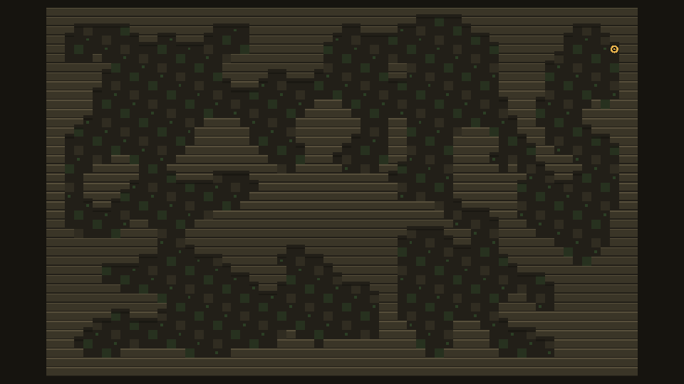

# DriftLands ⚔️

**A top-down dungeon-crawler RPG built in Godot 4 — procedurally generated floors, loot with rarity, leveling, equipment, stat upgrades, daily unlocks, monsters and bosses.** Hand-made pixel-art assets, a deliberate "ruined keep" palette (no neon, no purple), and a build you can play in your browser.

> Descends from **[DriftCaves](https://github.com/hxyng/driftcaves)** — the cellular-automata generation, flood-fill connectivity, and A\* pathfinding that drew caves there now generate the dungeon floors and drive the monster AI here.

### ▶️ Play it live: `https://hxyng.github.io/driftlands/`

---

## Features (in progress — built milestone by milestone)

- **Procedural floors** — every level is a freshly generated, guaranteed-connected cave; the exit is the farthest point, so each floor is a real journey.
- **Combat** — real-time melee + ranged, monsters that hunt you with A\* pathfinding, bosses with attack patterns.
- **Progression** — XP and leveling, loot drops with rarity tiers, equippable gear with stat modifiers, a stat-upgrade tree, and a roguelite meta-loop (souls + permanent upgrades).
- **Daily unlocks** — a streak-based daily reward keyed to the calendar.
- **Juice** — hit flash, screen shake, floating damage numbers, particles, squash-and-stretch animation.
- **My own assets** — every sprite and tile is generated by a script in [`tools/`](tools/), not stock art.

## Engines

- **Godot 4 / GDScript** — the full game (web-playable, CI-deployed).
- **Unity / C#** — the shared RPG core (stats, XP, loot, equipment, combat) is also ported to a Unity project under [`unity/`](unity/) and verified with `dotnet test`, demonstrating the same design across two engines.

## Tech lineage

Cellular-automata generation · flood-fill connectivity · BFS reachability · A\* pathfinding · custom tile rendering · HTML5/WebAssembly export · GitHub Actions CI/CD · a Playwright harness that screenshots the running build for visual review.

## Run locally

1. Install **[Godot 4.3+](https://godotengine.org/download)**.
2. Import `project.godot`, press **F5**.

## Controls

`WASD` / arrows move · `J` / `Space` / left-click attack · `K` / `Shift` dash · `E` interact · `I` / `Tab` inventory · `U` upgrades · `Esc` pause.

## License

[MIT](LICENSE) © 2026 Huy Nguyen
