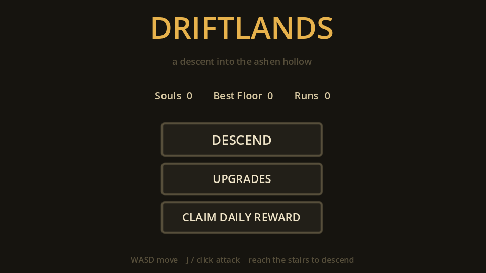
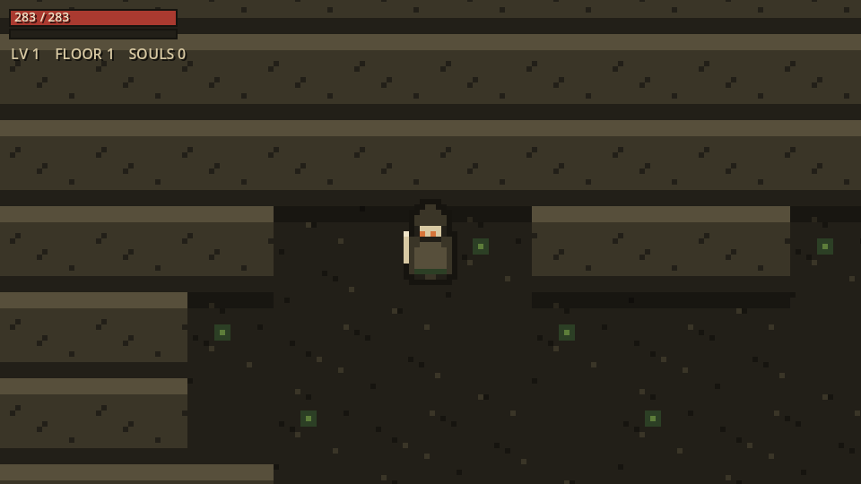
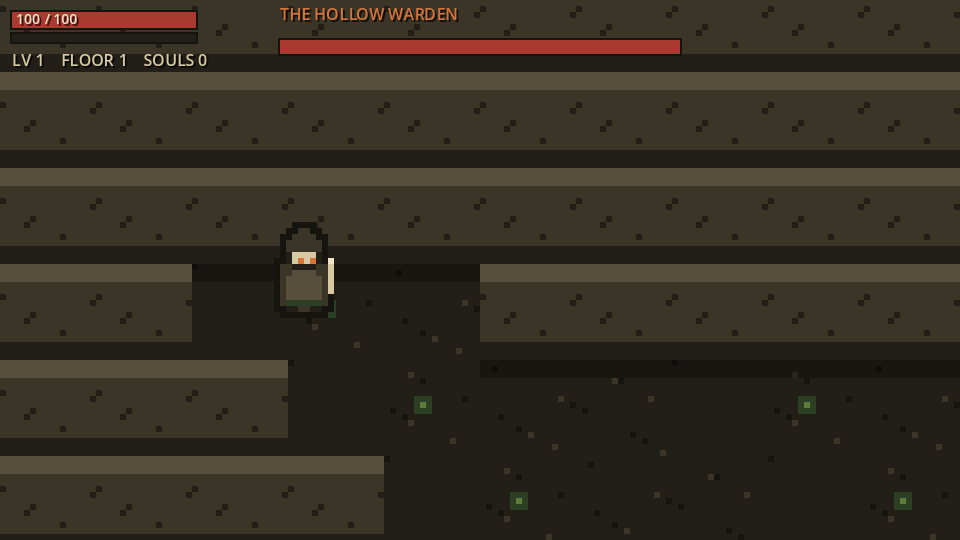
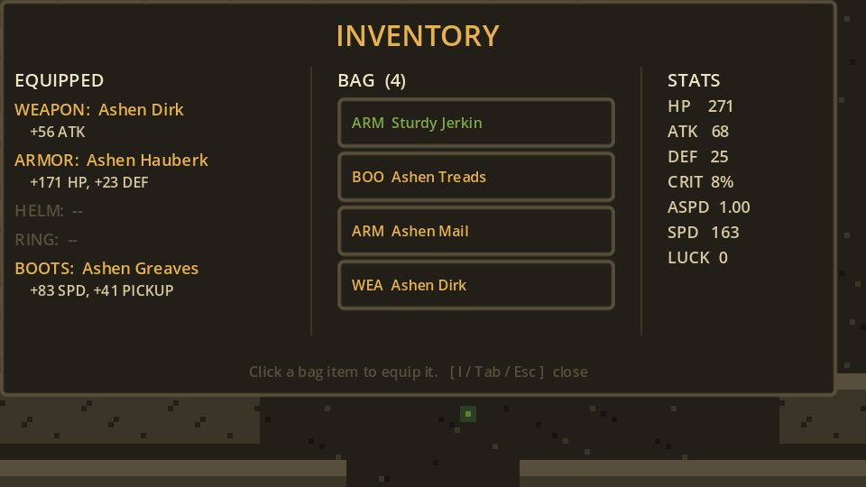
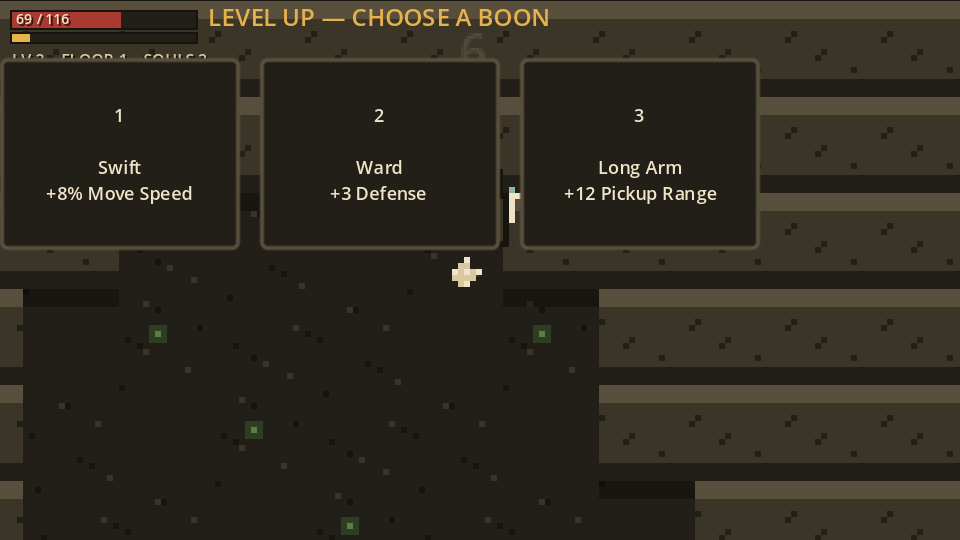

# DriftLands ⚔️

**A top-down dungeon-crawler RPG built in Godot 4 — procedurally generated floors, loot with rarity, leveling, equipment, stat upgrades, daily unlocks, monsters and a boss.** Every sprite is generated by a script, the palette is a deliberate "ruined keep" of bone, moss, rust and amber (no neon, no purple), and the whole thing plays in your browser.

> Descends from **[DriftCaves](https://github.com/hxyng/driftcaves)** — the cellular-automata generation, flood-fill connectivity, and A\* pathfinding that carved caves there now generate the dungeon floors and drive the monster AI here.

### ▶️ Play it live: **[hxyng.github.io/driftlands](https://hxyng.github.io/driftlands/)**



---

## What's in it

| | |
|---|---|
|  | **Procedural floors & real-time combat.** Every floor is a freshly generated, guaranteed-connected dungeon; the stairs sit at the farthest reachable point, so each descent is a real journey. Monsters hunt you with A\* pathfinding; a radial melee whirl keeps swarms survivable. |
|  | **Bosses every 5th floor.** *The Hollow Warden* — a scaled-up brute with a dedicated HP bar and a three-orb ember volley — guards floors 5, 10, 15… and drops a guaranteed high-tier item plus a soul windfall. |
|  | **Equipment & inventory.** Five slots (weapon/armor/helm/ring/boots), loot with five rarity tiers, live stat totals, and one-click gear swaps from the bag — pausable mid-run. |
|  | **Leveling & boons.** XP on every kill, a quadratic level curve, and a choose-one-of-three boon screen on level-up. |

Plus a roguelite **meta-loop** — souls banked on death buy permanent stat upgrades — a **streak-based daily reward** keyed to the calendar, and the **juice**: hit flash, screen shake, floating damage numbers, particle bursts, and frame animation.

## Two engines

- **Godot 4 / GDScript** — the full game (web-playable, CI-deployed). 28 headless logic tests gate every commit.
- **Unity / C#** — the shared RPG core (stats, combat, XP, loot, equipment, daily, upgrades) is ported to a dependency-free C# library under [`unity/`](unity/) and verified by 25 parity tests via `dotnet run`. The same design, proven across two engines.

## How it's built

```
src/
  core/        palette, shared constants
  app/         autoloaded Game (input map, save/load)
  rpg/         pure logic: stats · combat · progression · loot · equipment · inventory · daily · upgrades · boons
  world/       dungeon generation · tile rendering · the Level orchestrator
  actors/      player · enemies · boss · projectiles · pickups (data-driven monster roster)
  ui/          HUD · menus · inventory · boon screen (one shared UiTheme)
  fx/          frame animation · damage numbers · screen shake · one-shot effects
tools/         the procedural pixel-art generator (pure Python, zero deps)
scripts/       the Playwright "second pair of eyes" screenshot harness
unity/         the C# port + dotnet test project
tests/         headless GDScript test runner (CI gate)
```

The `rpg/` layer touches no nodes and no rendering — it's the same pure logic the Unity port mirrors. See **[ARCHITECTURE.md](ARCHITECTURE.md)** for the full breakdown and an honest self-review.

## Tech lineage

Cellular-automata generation · flood-fill connectivity · BFS reachability fields · A\* pathfinding · greedy-meshed wall collision · custom tile rendering · procedural pixel-art assets · HTML5/WebAssembly export · GitHub Actions CI/CD → Pages · a Playwright harness that screenshots the running build so changes are reviewed by sight, not by faith.

## Run locally

1. Install **[Godot 4.3+](https://godotengine.org/download)**.
2. Open `project.godot`, press **F5**.

Regenerate the art: `python tools/gen_assets.py`. Run the logic tests: `godot --headless --script res://tests/test_runner.gd`.

## Controls

`WASD` / arrows move · `J` / `Space` / left-click attack · `K` / `Shift` dash · `E` interact · `I` / `Tab` inventory · `U` upgrades · `Esc` pause.

## License

[MIT](LICENSE) © 2026 Huy Nguyen
